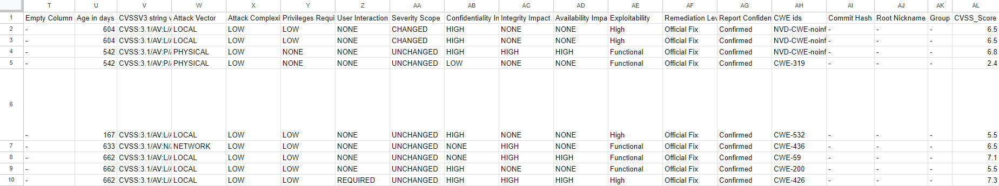
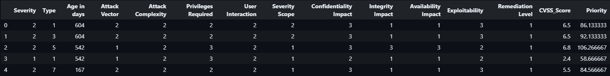

# Priorización de Vulnerabilidades en DevSecOps

## Peraración de datos

Inicialmente, se crea un conjunto de datos con 23439 muestras, las cuales se obtienen de la *NATIONAL VULNERABILITY DATABASE (NVD)*. La NVD es el repositorio gubernamental estadounidense de datos de gestión de vulnerabilidades basados en estándares y representados mediante el Protocolo de Automatización de Contenidos de Seguridad (SCAP).

Para que el conjunto de datos sea lo más similar posible a la muestra entregada, se tomaron diferentes medidas, ya que, las vulnerabilidades importadas carecen de cierta información necesaria. Por lo tanto, se opta por completar los campos faltantes con guiones ("-"). Esta elección se basa en la observación de que el ejemplo de referencia también contiene información incompleta, la cual no es relevante para la resolución del problema en cuestión.

En cuanto a la información que se considera relevante y que no se encuentra en las vulnerabilidades importadas, se completa siguiendo las posibilidades presentadas en el ejemplo de referencia. Para ello, se genera información aleatoria que se ajusta a dichas posibilidades.

En el ejemplo, se observa que la característica 'Severity' corresponde con el puntaje CVSS V3.1. Siguiendo las pautas para abordar el problema, donde la severidad se define con valores como 'Baja', 'Media' y 'Alta', se utiliza esta característica para asignar la severidad de la vulnerabilidad. Además, se crea una nueva columna llamada 'CVSS_Score', la cual almacena el puntaje CVSS V3.1.

Para la característica 'Type' y dado que la NVD no proporciona información sobre el tipo de ataque, se crea una lista que incluye algunos de los tipos de ataque más comunes. Dicha lista se organiza de menor a mayor severidad según criterio personal. Como resultado, una función devuelve un elemento de la lista con una probabilidad de ocurrencia de mayor a menor para asignar a cada muestra.

A continuación se observa un ejemplo del conjunto de datos generados.




## Preprocesamiento

Se importa la base de datos y se extrae las columnas con información relevante. Aunque la columna 'Description' contenga información relevante, se descarta debido a la infinidad de posibilidades que posee, por ende no se le puede asignar un valor numérico. Se le asigna un valor numérico a las columnas de tipo texto. Los valores se asignan empezando desde el 1 quién representa menor severidad y aumentando mientras aumenta la severidad. Para temas de compatibilidad con la base de datos de ejemplo, se tiene en cuenta que los textos de las vulnerabilidades importadas están en mayúsculas y las del ejemplo, la primera letra en mayúscula y las demás en minúsculas.

## Entrenamiento del modelo

El objetivo es calcular o predecir la prioridad de cada vulnerabilidad, sin embargo, en el ejemplo proporcionado, no se incluye este dato de prioridad. Por lo tanto, se asume que se debe utilizar un algoritmo de aprendizaje no supervisado. La cuestión con estos algoritmos es que se utilizan principalmente en problemas de clasificación, ya que los algoritmos de aprendizaje no supervisado para problemas de regresión todavía se encuentran en investigación de acuerdo al estado del arte.

Se asume que el problema es de regresión porque se solicita la entrega del top 10 de vulnerabilidades con mayor prioridad. Para abordar un problema que requiere un modelo de aprendizaje supervisado de regresión, se opta por crear una función que calcule la prioridad en función de las características previamente procesadas. Esta función es la que el modelo deberá aprender. La función consistirá en una suma ponderada de pesos por cada característica, donde un valor más pequeño indicará una menor prioridad y un valor más grande indicará una mayor prioridad.

### Función de prioridad

El peso de cada característica indica que tanta información va a aportar al valor de prioridad (valores de peso grandes aportan mayor información y valores de peso pequeños aportan menor información), por lo que los pesos se elegirán a criterio personal. Posteriormente, se puede observar que tanta información aporta cada característica con la correlación entre estas y la prioridad, la cual debe ir acorde a los pesos asignados en la función.

Las variables de cada característica son las siguientes:
```
Severity=S   Type=T   Age in days=D   Attack Vector=AV   Attack Complexity=AC   Privileges   Required=PR   User Interaction=UI   Severity Scope=SS   Confidentiality Impact=C   Integrity   Impact=I   Availability Impact=A   Explotability=E   Remediation Level=R   CVSS_Score=VS
```

Entonces la función de prioridad se define de la siguiente forma:

$$
Priority = 2S + 3T + \frac{D}{30} + AV + AC + PR + UI + SS + 3C + 3I + 3A + 2E + R + 4VS
$$

A continuación se presenta un ejemplo de los datos con la nueva columna 'Priority':


### Correlación 

Es una medida estadística que se utiliza para evaluar la relación entre dos conjuntos de datos. Mide la fuerza y la dirección de la asociación entre las variables, indicando si aumentan juntas (correlación positiva), disminuyen juntas (correlación negativa) o no tienen una relación lineal clara (correlación cercana a cero). La correlación es útil para comprender cómo las variables se comportan en conjunto y puede ser importante en análisis de datos y toma de decisiones.
A continuación se presenta la crrelación de cada característica con la prioridad, demostrando que la correlación es mayor en las características a las que se les asignó un mayor peso.

Severity                  0.834688\
Type                      0.346378\
Age in days               0.277838\
Attack Vector             0.133471\
Attack Complexity         0.037475\
Privileges Required       0.240492\
User Interaction          0.253662\
Severity Scope           -0.267521\
Confidentiality Impact    0.548601\
Integrity Impact          0.637268\
Availability Impact       0.620410\
Exploitability            0.103032\
Remediation Level         0.002902\
CVSS_Score                0.874745\
Priority                  1.000000

### Elección de algoritmo

Como el problema a resolver es lineal, con un modelo de regresión lineal es posible solucionarlo, sin embargo, para efectos de demostrar mayores conocimientos en aprendizaje de máquina se elige otro algoritmo capaz de resolver problemas lineales. A continuación se mencionan algunos de los algoritmos más utilizados en problemas supervisados regresivos:

**Árboles de decisión:** Modelos no lineales que pueden manejar relaciones más complejas entre las características y la variable objetivo.

**Máquinas de vectores de soporte (SVM):** Útiles para problemas de regresión cuando se busca encontrar una función de decisión que maximice el margen entre diferentes clases de datos.

**Regresión de vecinos más cercanos (K-NN):** Modelo simple que se basa en la similitud entre instancias de datos para predecir la variable objetivo.

**Redes neuronales:** Modelos de aprendizaje de máquina inspirados en el cerebro humano que se utilizan para capturar patrones y relaciones en los datos, siendo efectivas en una variedad de aplicaciones, incluyendo clasificación, procesamiento de lenguaje natural y visión por computadora.

Se decide utilizar las redes neuronales artificiales gracias a su capacidad de resolver diferentes tipos de problemas, incluyendo problemas lineales.


