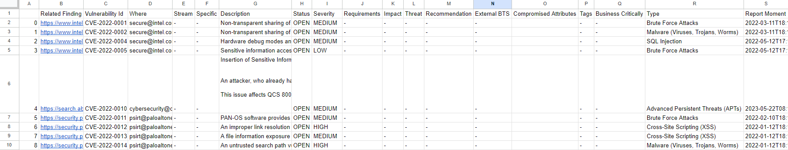

# Priorización de Vulnerabilidades en DevSecOps

## Peraración de datos

Inicialmente se crea un conjunto de datos con 24245 muestras, las cuales se obtienen de la *NATIONAL VULNERABILITY DATABASE (NVD)*. La NVD es el repositorio gubernamental estadounidense de datos de gestión de vulnerabilidades basados en estándares y representados mediante el Protocolo de Automatización de Contenidos de Seguridad (SCAP).

Para que el conjunto de datos sea lo mas similar posible a la muestra entregada, se tomaron diferentes medidas, ya que, las vulnerabildiades importadas carecen de cierta información necesaria. Por lo tanto, se opta por completar los campos faltantes con guiones ("-"). Esta elección se basa en la observación de que el ejemplo de referencia también contiene información incompleta, la cual no es relevante para la resolución del problema en cuestión.

En cuanto a la información que se considera relevante y que no se encuentra en las vulnerabilidades importadas, se completa siguiendo las posibilidades presentadas en el ejemplo de referencia. Para ello, se genera información aleatoria que se ajusta a dichas posibilidades.

En el ejemplo, se observa que la característica 'Severity' corresponde con el puntaje CVSS V3.1. Siguiendo las pautas para abordar el problema, donde la severidad se define con valores como 'Baja', 'Media' y 'Alta', se utiliza esta característica para asignar la severidad de la vulnerabilidad. Además, se crea una nueva columna llamada 'CVSS_Score', la cual almacena el puntaje CVSS V3.1.

Para la carácteristica 'Type' y dado que la NVD no proporciona información sobre el tipo de ataque, se crea una lista que incluye algunos de los tipos de ataque más comunes. Dicha lista se organiza de mayor a menor severidad según criterio personal. Como resultado, una función devuelve un elemento de la lista con una probabilidad de ocurrencia de menor a mayor para asignar a cada muestra.

A continuación se observa un ejemplo del conjunto de datos generados.

